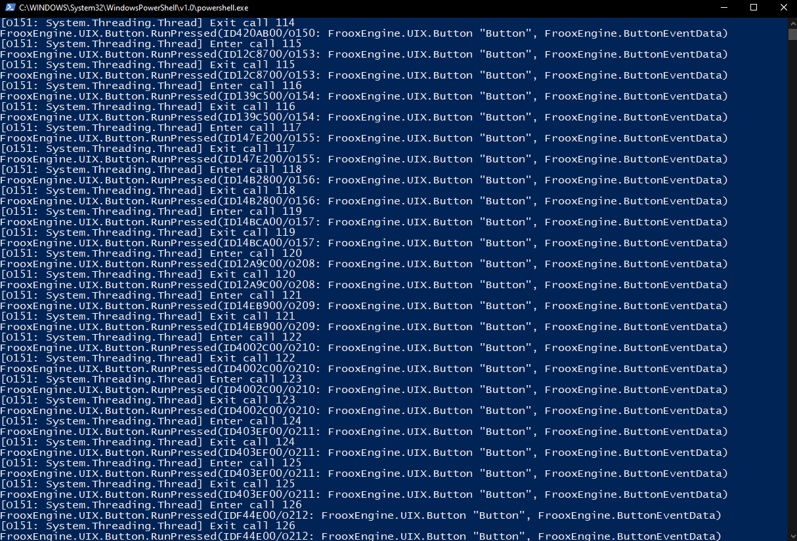
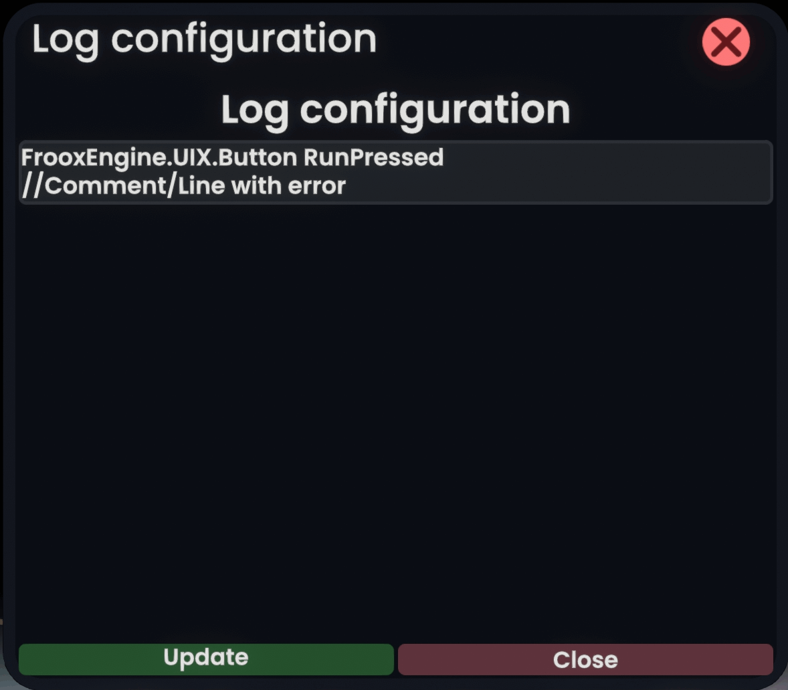
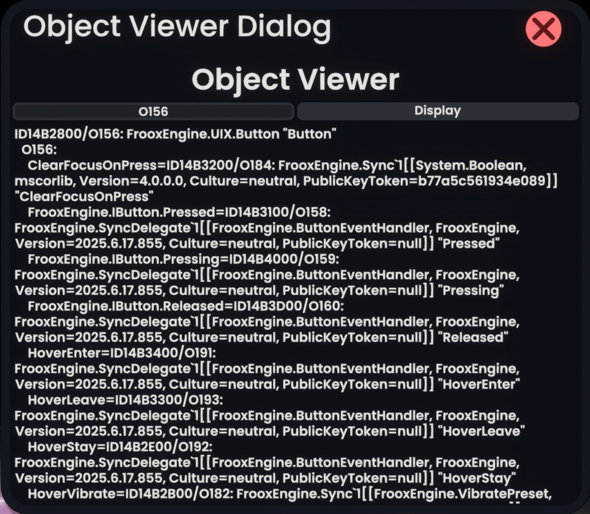

# ResoniteDiagnosticsMod

A [ResoniteModLoader](https://github.com/resonite-modding-group/ResoniteModLoader) mod for [Resonite](https://resonite.com/) that adds additional logging and allows inspecting objects outside the world model.
This aids in debugging mods or when diagnosing issues within Resonite.

## Screenshots

(raw log output of method calls and exits including their arguments)

## Installation
1. Install [ResoniteModLoader](https://github.com/resonite-modding-group/ResoniteModLoader).
1. Place [ResoniteDiagnosticsMod.dll](https://github.com/mpmxyz/ResoniteDiagnosticsMod/releases/latest/download/ResoniteDiagnosticsMod.dll) into your `rml_mods` folder. This folder should be at `C:\Program Files (x86)\Steam\steamapps\common\Resonite\rml_mods` for a default install. You can create it if it's missing, or if you launch the game once with ResoniteModLoader installed it will create this folder for you.
1. Start the game. If you want to verify that the mod is working you can check your Resonite logs.

## Usage
Equipping a `DevTool` will offer two additional context menu options:
- `Edit Logging...` allows setting the filters that define which method calls are logged:
  
  An example filter looks like this:
  ```
  Full.Class.Name MethodName.*RegEx "ThisReg[e]x" * "Arg[1]Regex"
  ```
	- The class name should be fully qualified. (required)
	- Public and private method's names are matched as a regular expression. (required)
	- Value filters are regular expressions enclosed in quotes. (optional)
		- Primitive values are matched with their `ToString` value.
		- Objects are matched with their `O-ID` (generated by the mod when output to the log) or their `RefID` (if part of the world model)
		- A single \* without quotes represents a more performant "don't care" filter.
	- The filter configuration is only updated when hitting the button `Update`.
	- Invalid lines are commented out using the prefix "//".
		- Check the Resonite log to figure out what was wrong!
- `View Object...` spawns a window that allows inspecting arbitrary objects:
	
	- All non-value objects are printed to the log together with a unique `O-ID` which is generated by the mod whenever such an object is mentioned.
	- This `O-ID` (e.g. "O156") can be entered into the textfield. A click on `Display` shows the properties of that object within the window.
	- All objects mentioned within the window are also displayed with their `O-ID`. This allows diving deeper into the internals.
	- Entering `RefID`s is also possible and will be evaluated in the context of the world the window is placed in.
